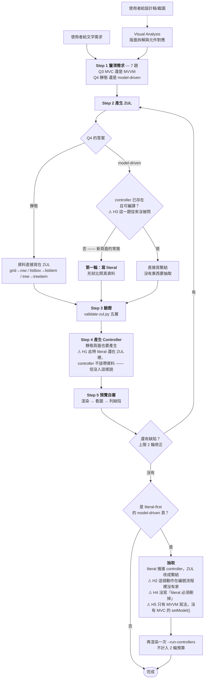
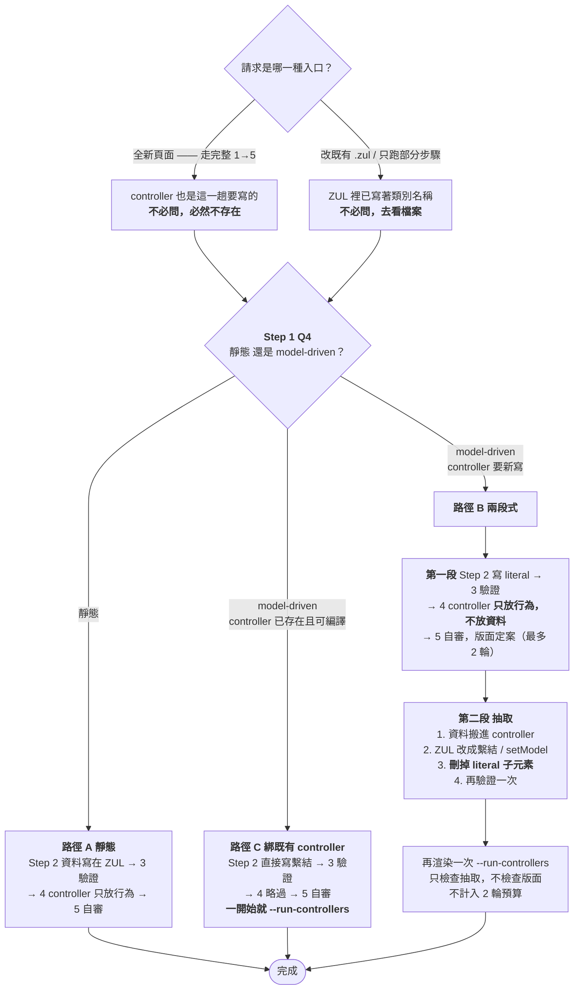

# zul-writer 資料流程 review：static data vs model-driven

目的：把技能**目前實際寫的**流程畫出來，找出「literal 什麼時候寫、什麼時候刪」這條線上的斷點。
依據是 `skills/zul-writer/SKILL.md` 全文（589 行），不是記憶。

---

## 一、先回答那個問題

**有問。** `SKILL.md` Step 1 的第 4 題就是這一題，而且明寫要獨立問：

> #### 4. Static Data or Model-Driven
> Ask this as its own question. It is independent of MVC/MVVM — that choice decides where
> *behaviour* lives, this one decides where *data* lives — and it changes the order the work
> happens in.

所以「有沒有問」不是問題所在。問題在**問完之後**：答案是 model-driven 時，流程要走的那條路
在編號步驟裡是斷的。

---

## 二、現況流程圖



---

## 三、五個斷點

| # | 斷點 | 現況怎麼寫的 | 為什麼會出事 |
|---|---|---|---|
| **H1** | **Step 4 排在 Step 5 之前，但 literal-first 頁面此時的 controller 不該有資料** | Step 4 只說「靜態頁面也要產生 controller」，沒說 model-driven 的第一輪 controller 該長什麼樣 | 順著 1→2→3→4→5 讀下來，代理會在 Step 4 就把資料寫進 controller。接著 Step 5 用 `--run-controllers` 一渲染 —— **literal-first 規則等於從來沒發生過**。這是最大的洞 |
| **H2** | **「抽取」在編號流程裡沒有家** | 寫在 Step 2 的〈Model-driven pages〉散文裡，但它的觸發條件是「版面定案」，那是 Step 5 的產出 | 一個只能在 Step 5 之後執行的動作，說明卻放在 Step 2。流程實際上是 1→2→3→4→5→**回到 2**→4→5，而這個回頭的箭頭從來沒被畫出來 |
| **H3** | **決定路徑的第三個輸入沒被問** | 「controller 已存在且可編譯嗎」只出現在 Step 2 的散文（第 196、208 行） | Step 1 問了 Q3、Q4，但真正決定要不要走兩段式的是這第三題。它不在七題裡，所以代理常常自己猜 |
| **H4** | **「literal 必須刪掉」從來沒寫** | Step 2 說 `move each literal into the controller ... and replace it in the ZUL with the binding` | 對 `@load(vm.customer.name)` 這種**值**的替換，「replace」講得通。對 **model** 就不通了：你是**加上** `model=` 和 `<template>`，literal `<listitem>` 得**另外刪**。散文沒說要刪 —— 而實測（見下）不刪也不會有任何聲音 |
| **H5** | **抽取只有 MVVM 版** | 抽取段落舉的例子全是 `@load(vm.customer.name)`、`model="@load(vm.items)"` | MVC 的抽取目標是 Java 端的 `setModel()`（＋ renderer），技能全文沒有提過一次。R2 就是撞在這裡 |

---

## 四、H4 的實測依據

2026-09-01，四種配置各渲染一次，全部 `STATUS: ok`、零警告：

| 配置 | 結果 |
|---|---|
| MVVM listbox：`model="@load(vm.items)"` ＋ literal `<listitem>` | literal **消失** |
| MVC listbox：literal `<listitem>` ＋ `setModel(10 筆)` | literal **消失** |
| MVC listbox：literal `<listitem>` ＋ `setModel(空 list)` | literal **消失**，整張列表空白 |
| MVVM grid：`model="@load(vm.items)"` ＋ literal `<row>` | literal **消失** |

**model 一律吃掉 literal，連空 model 都吃，而且不出聲。** 所以忘了刪的頁面**渲染起來完全正確** ——
Step 5 看圖在結構上不可能抓到它。錯的只有 ZUL 原始碼：它留著一段宣稱要顯示資料、
實際上永遠不顯示的標記，下一個去改那一行的人會發現怎麼改都沒反應。

這正好對應使用者的規則：**「如果 Controller 設了 Model，就會以那邊為主」** —— 實測確認為主到
literal 完全不存在的程度。

---

## 五、提案流程

改動集中在一件事：**把 controller 的「行為」和「資料」拆成兩個時間點**。
H1 的根因就是這兩件事現在都擠在 Step 4。

### H3 的修正：那不是一個問題，是一個查得到的事實

初版提案要在 Step 1 加一題「controller 已存在且可編譯嗎？」。**這是錯的，理由有兩層：**

1. **走完整 1→5 流程時，這題的答案是恆定的。** 從第一步開始就代表要產生一個新的 ZUL，
   而 ZK 的 Composer／ViewModel 是**綁在頁面上的**（`apply=` / `viewModel=`），不是共用的服務層 ——
   新頁面的 controller 本來就是這一趟要寫的。所以「已存在」在完整流程裡根本不會發生。
2. **會發生的場合，答案不必用問的。** controller 已存在只出現在「改一個既有的 `.zul`」這條入口，
   而那時候 ZUL 裡已經寫著類別名稱，**去看檔案在不在、能不能編譯就知道了**。
   拿一個查得到的事實去問使用者，是用錯工具。

技能其實已經有處理這件事的機制，只是沒接上：Workflow Overview 的
〈Run only the steps the request needs〉已經說了「跳過的步驟仍然餵給你要跑的步驟 ——
從檔案和使用者訊息裡讀出來，不要重啟 Step 1」。**H3 的解是把這條既有原則套到 controller 上，
而不是多問一題。**

### 提案流程圖



**注意路徑 C 的位置變了**：它不是 Step 1 的一個選項，而是「改既有 ZUL」這條入口自帶的狀態。
完整流程進來的頁面永遠走不到 C。

**具體要改的四處：**

1. **不加 Q4b。** 改在 Step 2 的 model-driven 段落把分歧寫成查詢而非提問：
   「ZUL 若已指名 controller 類別，去看它在不在、能不能編譯；全新頁面的 controller 是你要寫的，
   一律走兩段式。」並在 Workflow Overview 的入口表加一列說明路徑 C 從哪裡來。這是 H3 的解。
2. **Step 4 明寫兩種產出**：靜態與 literal-first 的第一輪，controller **只放行為**（事件、`@Command`），
   資料等抽取時才進去。這是 H1 的解。
3. **抽取獨立成一個具名段落**，並在 Workflow Overview 的表格裡畫出「Step 5 → 抽取 → 再渲染」這條回頭的線。
   這是 H2 的解。
4. **抽取的四個動作逐條寫出來**，其中第 3 條是新的：**刪掉 literal 子元素**，並附上實測理由
   （model 會吃掉它，所以留著只會騙人）。同時補上 MVC 的 `setModel()` 寫法。這是 H4、H5 的解。

---

## 六、與已決事項的關係

* **D16 = B**：Step 1 Q3 問不到時，先數專案 ZUL 側的 `apply=` / `viewModel=`，一面倒就跟，混合才回到 MVC 預設。
* **D17 = A**：`<charts>` 沒有 literal 路徑，該區塊豁免路徑 B 的第一段，從一開始就走 controller。
* **D18 = C**：H4 由 `preview-zul.py` 抓 —— **偽陽性已量測，見第七節，規則形狀已定案。** 訊號是
  **「ZUL 裡寫了 literal，但 `--run-controllers` 的 DOM 裡找不到那段文字」** ——
  它不在乎 `setModel()` 寫在 Java 還是 `model=` 寫在 ZUL，所以 MVC 與 MVVM 兩側都能覆蓋。
  當初選 C 時列的前提是「分頁與虛擬捲動會不會誤報」—— **已量測完畢**：分頁確實是偽陽性來源，
  虛擬捲動則根本不存在（沒有 model 就沒有 ROD）。兩道守則擋下全部六個偽陽性候選，
  五個真陽性全數命中。細節見第七節。

---

## 七、D18 選項 C 的偽陽性量測（2026-09-01）

### 要問的問題

規則的天真版本是「ZUL 寫了 literal 文字，渲染後的 DOM 裡找不到它」。問題是：**還有哪些
情況會讓 literal 合法地不出現在 DOM 裡？** 每一種都是一個偽陽性來源。逐一渲染實測，
每個 literal 都帶唯一標記，再對 `--dump-dom` 的輸出逐字串比對。

### 結果

| 情境 | 宣告 | 出現在 DOM | 是偽陽性來源嗎 |
|---|---|---|---|
| listbox `mold="paging" pageSize="3"`，9 筆 literal，無 model | 9 | **3**（第 1–3 筆） | ⚠️ 是 |
| grid `mold="paging" pageSize="3"`，9 筆 literal，無 model | 9 | **3**（第 1–3 筆） | ⚠️ 是 |
| **60 筆 literal 塞進 120px 高的 listbox（捲動）** | 60 | **60，全部** | ✅ **否** |
| tree 收合節點底下的子項 | 1 | **0**（收合的父節點本身有渲染） | ⚠️ 是 |
| `visible="false"` 的 label | 1 | **1**（渲染了，只是隱藏） | ✅ 否 |
| 未選取的 tabpanel 裡的 listbox | 2 | **0**，而且**整個 listbox 都不在 DOM 裡** | ⚠️ 是 |

**最大的疑慮被推翻了：沒有 model 就沒有 ROD／虛擬捲動。** 60 筆全部進了 DOM，
捲動純粹是 CSS overflow。原本以為最危險的那一項，實際上零風險。

未選取的 tabpanel 在 DOM 裡長這樣 —— 一個空殼，裡面的 listbox 完全不存在：

```html
<div id="lDXF9" style="display:none"></div>
```

### 定案的規則形狀

三個偽陽性來源都有共同的結構，所以兩道守則就能全部擋掉：

> 對每一個在 ZUL 裡宣告了 literal 子項的資料元件（listbox／grid／tree）：
>
> 1. **守則一 —— 元件本身要在 DOM 裡。** 不在就跳過（未選取的 tabpanel 等），**判斷不了就不判斷**。
> 2. **守則二 —— 只要有任何一筆 literal 文字出現，就跳過。** 分頁只藏得住第一頁以外的，
>    收合的樹節點藏不住自己那一列 —— 這些情況一定至少有一筆活著。
> 3. 兩道都通過（元件有渲染、卻**一筆 literal 都找不到**）→ **是 model 吃掉了它們，開罰。**

### 對照驗證

| 情境 | 元件在 DOM？ | 有任何 literal 出現？ | 規則觸發 | 正確？ |
|---|---|---|---|---|
| 分頁 listbox，無 model | 是 | 是（第 1–3 筆） | 否 | ✅ |
| 分頁 grid，無 model | 是 | 是（第 1–3 筆） | 否 | ✅ |
| 60 筆捲動，無 model | 是 | 是（全部） | 否 | ✅ |
| tree 收合節點 | 是 | 是（父節點那一列） | 否 | ✅ |
| 未選取 tabpanel 裡的 listbox | **否** | — | 否（守則一） | ✅ |
| MVVM listbox：model ＋ literal | 是 | **否** | **是** | ✅ 真陽性 |
| MVC listbox：literal ＋ `setModel(10 筆)` | 是 | **否** | **是** | ✅ 真陽性 |
| MVC listbox：literal ＋ `setModel(空 list)` | 是 | **否** | **是** | ✅ 真陽性 |
| MVVM grid：model ＋ literal | 是 | **否** | **是** | ✅ 真陽性 |
| **MVVM listbox：model ＋ 分頁 ＋ literal**（最難的重疊case） | 是 | **否** | **是** | ✅ 真陽性 |

**六個偽陽性候選全數擋下，五個真陽性全數命中。** 最後一列是刻意設計的重疊案例 ——
分頁與 model 同時存在，也就是偽陽性與真陽性長得最像的時候：DOM 裡只有 Alice／Bob／Carol
三列，三筆 literal 一筆不剩，規則正確開罰。

### 殘留風險（記錄，不擋出貨）

一個資料元件的 literal 子項**全部**落在收合容器底下，而該容器自己沒有任何 literal 文字。
實務上構造不太出來（樹的根節點一定會渲染、grid 的 `<group>` 標題列也會），
但守則二在那個情況下會失效。等真的遇到再處理。

---

## 八、下一步

* [x] **實作 D18 選項 C** —— 已完成（`0c5d705`）：`literal-rows-discarded` 兩個偵測器 ＋ 六個 fixture ＋ A24/A25。
* [x] **改寫 `SKILL.md` 四處** —— 已完成（`0c5d705`）：H1–H5 全數落地。
* [x] **Step 1 逐題預設值 ＋ D16 的模式偵測腳本。** 已完成（2026-09-01）：SKILL.md 新增
  〈When there is no one to ask〉七題對照表，`scripts/detect-pattern.py` ＋ `test/run-pattern-tests.py` 7/7。
  順帶補完第 2 項剩下的兩個子問題（資料／版面文字分界、`<charts>` 豁免）。
* [ ] **重新檢討「最多兩輪修正」這個上限。** `07e52cf` 把預算從「渲染次數」改綁「編輯次數」，
  但**兩輪這個數字本身沒有被檢討過** —— 它是政策數字不是量測值（第九節第 3 項已記錄）。
  現在路徑 B 把第一段的自審和抽取後的驗證分成兩個階段，兩輪要怎麼分配也還沒定。值得單獨討論。
* [ ] **第 6 項（折疊元件狀態列舉）仍未裁示** —— 要列哪些元件。
